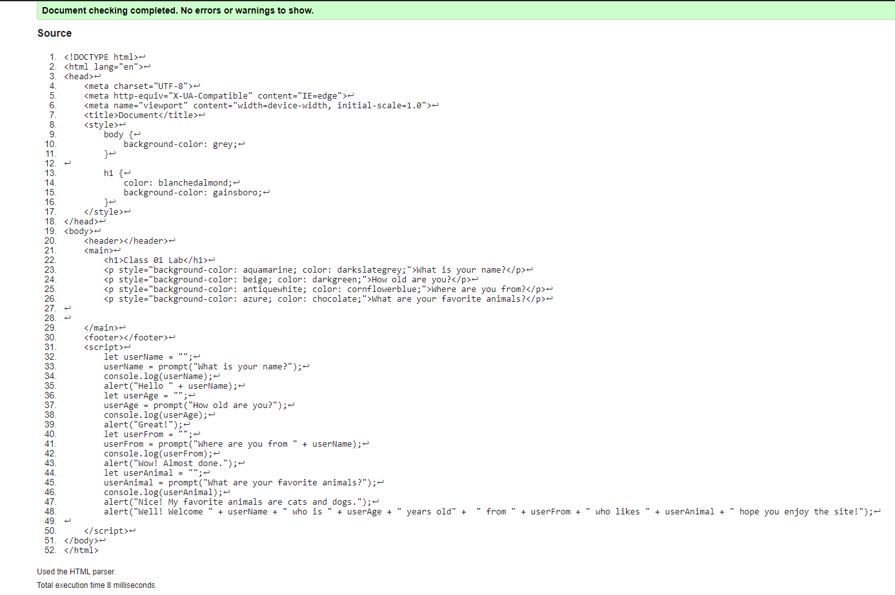
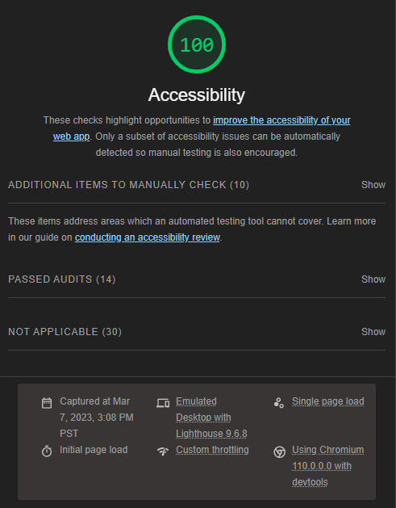
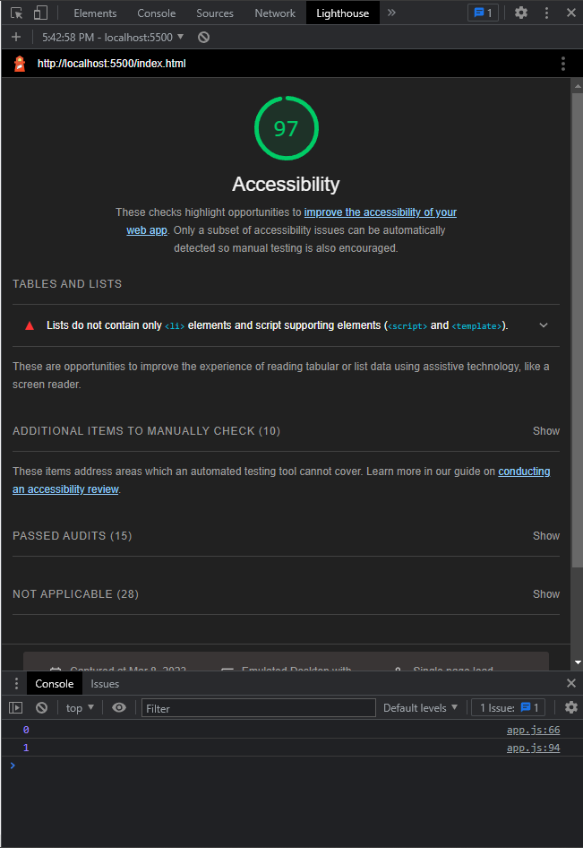
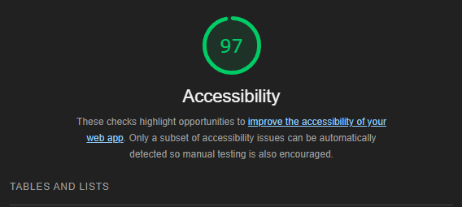

# Lab - 02

## About Me Project

I use HTML and CSS to properly structure and style my website, and JavaScript to utilize prompts and user input.

### Author: Kaeden O'Meara

### Lighthouse Accessability Report Score

Lab 01

Lab 02

Lab 03

Lab 04

Lab 05

### Reflections and Comments

I felt pretty good about what we went over today. I have seen Conditionals, Logical Operators, Expressions, and Statements in the class before this, and so it was nice to have this day to refresh on those. I am definitely still learning what all these mean, and I plan to learn to hold onto that information better over time.